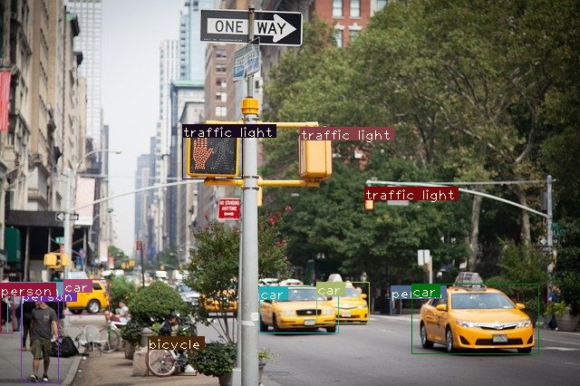

# YOLO: You Look Only Once

YOLO (“You Only Look Once”) is an effective real-time object recognition algorithm. 


<p align="center">
  
</p>

Image classification is one of the many exciting applications of convolutional neural networks. Aside from simple image classification, there are plenty of fascinating problems in computer vision, with object detection being one of the most interesting. It is commonly associated with self-driving cars where systems blend computer vision, LIDAR and other technologies to generate a multidimensional representation of the road with all its participants. Object detection is also commonly used in video surveillance, especially in crowd monitoring to prevent terrorist attacks, count people for general statistics, or analyze customer experience with walking paths within shopping centers.

In this project, I've implemented the YOLO-v3 algorithm from scratch using Pytorch(1.5). The python script files are heavily commented to understand the code implementation.


```
.
├── cfg
│   └── yolov3.cfg
├── darknet.py
├── data
│   └── coco.names
├── det
│   ├── det_dog-cycle-car.png
│   └── det_NY-city.jpg
├── detector.py
├── images
│   ├── dog-cycle-car.png
│   └── NY-city.jpg
├── pallete
├── Shell.ipynb
├── utils.py
└── yolov3.weights

```

```yolov3.cfg```: The cfg file describes the layout of the network, block by block. This file is used to describe the network.

```darknet.py```: Contains the Model Architecture

```pallete```: Just a file of random colors that would come handy while drawing bounding boxes around objects.

```utils.py```: Contains all the helper functions code.

```yolov3.weights```: Pretrained Weights of the model that was trained on the COCO dataset can be downloaded from [here](https://pjreddie.com/media/files/yolov3.weights)

```Shell.ipynb```: This notebook contains some description of the above-mentioned files along with the tests of the project.


## Pre-requisites
* You should understand how convolutional neural networks work. This also includes knowledge of Residual Blocks, skip connections, and Upsampling.

* What is object detection, bounding box regression, IoU and non-maximum suppression.

* Basic PyTorch usage. You should be able to create simple neural networks with ease.


## Installation

Use the package manager [pip](https://pip.pypa.io/en/stable/) to install foobar.

```bash
pip install opencv-python
pip install numpy
pip install pandas
```
To install Pytorch follow: [Pytorch](https://pytorch.org/get-started/locally/) 


## Usage

```
python detector.py --images path_to_images --det path_to_destination_folder
```

<p>
  
  
</p>

## Contributing
Pull requests are welcome. For major changes, please open an issue first to discuss what you would like to change.

Please make sure to update tests as appropriate.

## Acknowledgments

##### Useful Resources:
Ayoosh Kathuria : Check out his blog for more details about [YOLO](https://blog.paperspace.com/how-to-implement-a-yolo-object-detector-in-pytorch/)

##### COCO Dataset:
If you wanna train your own model from scratch you can download the dataset from [here](https://cocodataset.org/#home)
